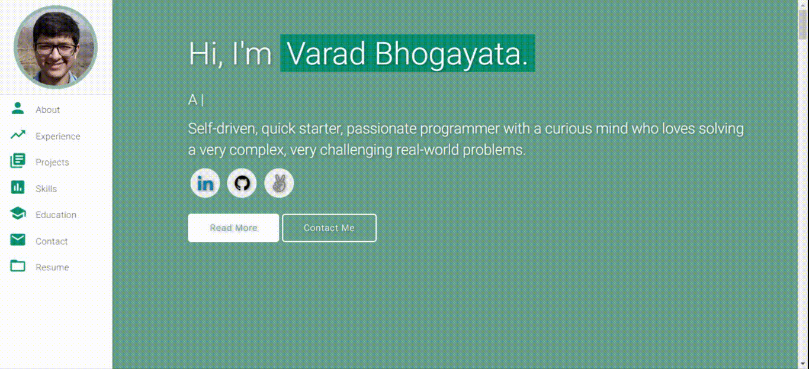
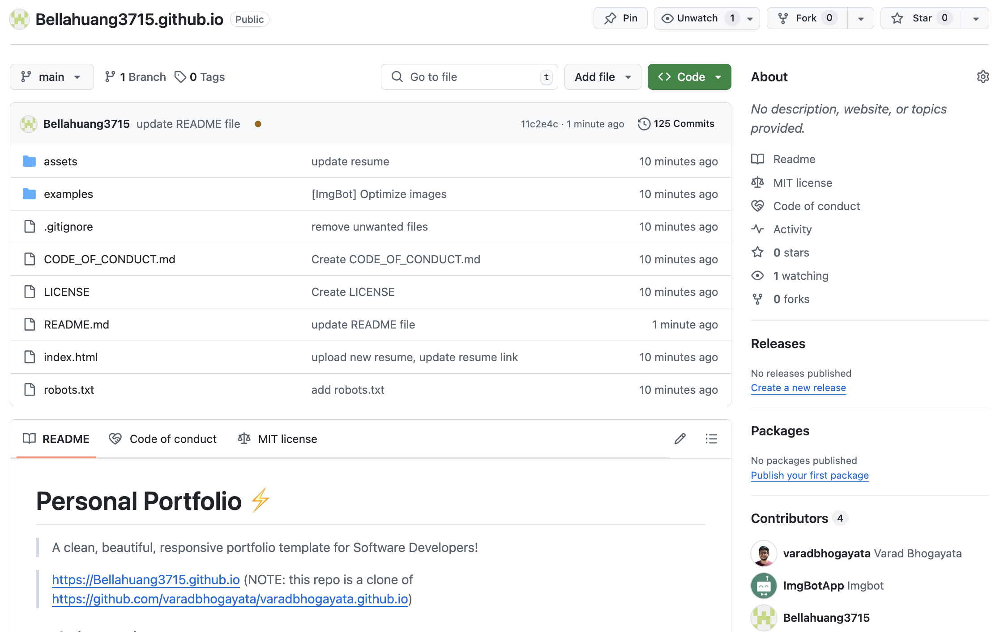
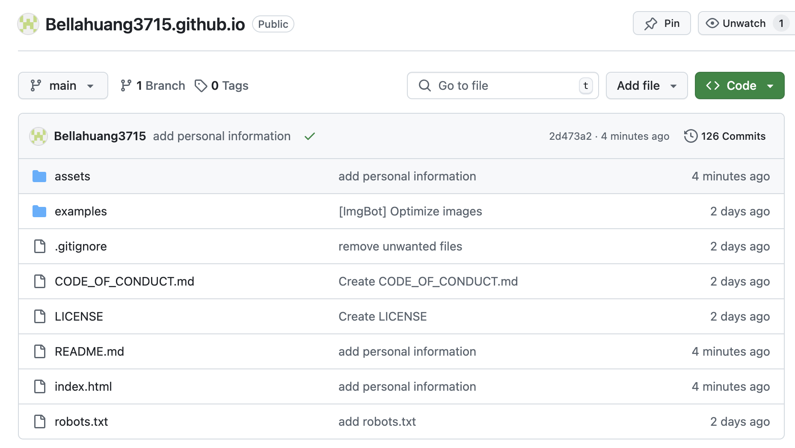
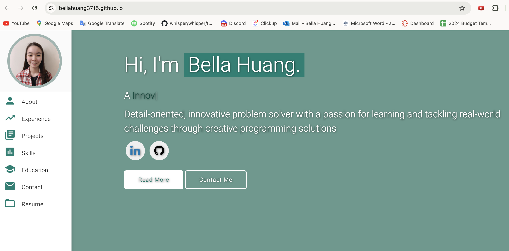
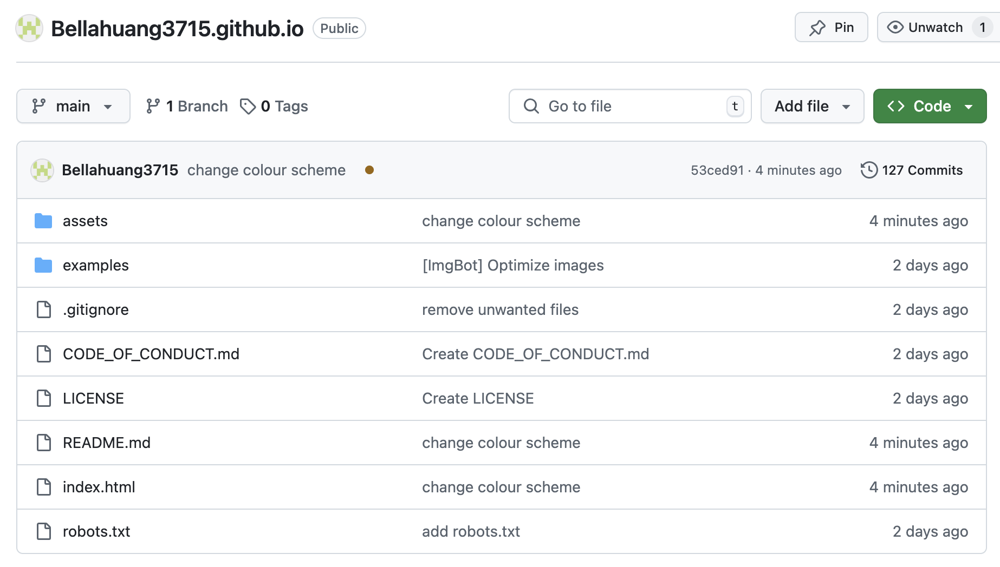
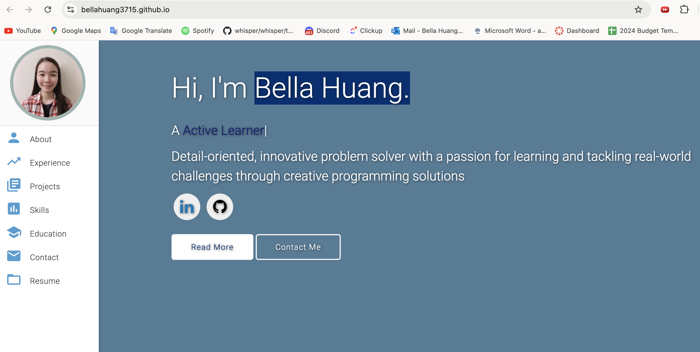

# Personal Portfolio ⚡️ 
> A clean, beautiful, responsive portfolio template for Software Developers!

> https://Bellahuang3715.github.io
(NOTE: this repo is a clone of
https://github.com/varadbhogayata/varadbhogayata.github.io)

<!-- ### Website Preview

 
  <kbd>
    
  </kbd>

 -->

## Activity-1

## Activity-2

## Activity-3

## License 📄
This project is licensed under the MIT License - see the [LICENSE.md](./LICENSE) file for details.
